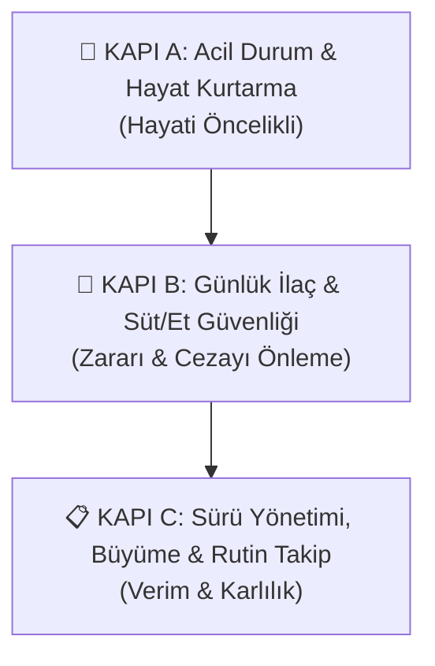

# 🐑 Koyun Sağlık Rehberi - Kullanım Kılavuzu

**Koyun Sağlık Rehberi**, internet bağlantısı ve sunucu kurulumu gerektirmeyen, doğrudan telefon ve bilgisayar tarayıcısında çalışan, Progressive Web App (PWA) mimarili çevrimdışı (%100 offline) bir küçükbaş sürü sağlığı, acil müdahale, aşı, koç katımı ve kuzu takip asistanıdır.

---

## 🚀 1. Hızlı Başlangıç & PWA Kurulumu

### Telefonunuza Yükleme (Android / iOS):
1. İnternet bağlantınız varken **[https://mserman90.github.io/koyun-saglik-rehberi/](https://mserman90.github.io/koyun-saglik-rehberi/)** adresini açın.
2. Tarayıcı menüsünden (üç nokta veya paylaş butonu) **"Ana Ekrana Ekle"** veya **"Uygulamayı Yükle"** seçeneğine dokunun.
3. Telefonunuzun ana ekranına uygulama simgesi eklenir. Artık merada, yaylada, internetin ve şebekenin hiç çekmediği taş ağıllarda dahi tam ekran ve jet hızında çalışır.

### Bilgisayarda Açma:
- Doğrudan web adresini açabilir veya depodaki [`index.html`](./index.html) dosyasını herhangi bir tarayıcıda çift tıklayarak çalıştırabilirsiniz.

---

## 🧭 2. Klinik & Operasyonel Mantık Sırası (3 Kapı Sistemi)

Uygulamanın tüm butonları, alt menüsü ve modülleri rastgele değil; bir ağılda veya merada karşılaşılan **klinik aciliyet** ve **ekonomik risk** sırasına göre **3 Mantıksal Kapı** halinde dizilmiştir:

1. **🚨 Kapı A: Acil Durum & Hayat Kurtarma:** Saniyelerin yarıştığı ölüm kalım anlarında ilk yardım ve klinik triyaj modülleri.
2. **🥛 Kapı B: Günlük İlaç & Süt/Et Güvenliği:** Antibiyotikli sütün tanka karışmasını, kasap/kesim cezalarını ve mali kayıpları önleyen İKAS, sağımcı ekranı ve zarar defteri.
3. **📋 Kapı C: Sürü Yönetimi, Büyüme & Rutin Takip:** Koç katımı, kuzu doğumu, aşı takvimi, şerit metreyle tartım, geviş sayımı ve sürü ıslahı operasyonları.

---

## 🚨 3. KAPI A: Acil Durum & Hayat Kurtarma (Hayati Öncelikli)

Ağılda veya merada acil bir kaza, donma veya zehirlenme olduğunda ilk başvurulacak hayat kurtarma kapısıdır.

### 🆘 3.1. Küçükbaş Acil İlk Yardım & Hayat Kurtarma
Veteriner hekim ağıla ulaşana kadar uygulanacak kritik protokoller:
- **⚖️ Canlı Ağırlık Doz Hesaplayıcı:** Koyunun veya kuzunun ağırlığı girildiğinde, anafilaktik şok için hayat kurtaran Adrenalin dozunu (1:1000 Adrenalin, her 45 kg için 1 mL) anında hesaplar.
- **🧠 Gebelik Zehirlenmesi (İkiz Koması / Ketozis):** Doğuma 2-3 hafta kala yerde yatan, kör gibi yürüyen gebe koyunlara ağızdan propilen glikol veya pekmez içirme, damardan glikoz serumu desteği.
- **⚡ Çelerme / Yem Çarpması (Enterotoksemi):** Ani tane yem/taze ot sonrası çırpınan hayvanda yemi derhal kesme, ağızdan karbonatlı su ve Clostridium antitoksin serumu.
- **❄️ Yeni Doğan Kuzu Donması & Üşüme (Hipotermi):** Ağzı buz gibi kuzuya süt zorlamama; ısıtma lambası/kutusuyla vücut ısındıktan sonra kolostrum verme.
- **💧 Sidik Zoru & İdrar Yolu Tıkanması:** Besi tokluları ve koçlarda penis ucu uzantısındaki (processus urethralis) tuz kristallerinin temizlenmesi.
- **🐺 Kurt / Köpek Isırması & Kanama:** Basınçlı tampon, yara temizliği, tetanoz aşısı ve antibiyotik kalkanı.
- **🌿 Bakır / Zehirli Ot Zehirlenmesi:** Zehirli otu kesme, aktif kömür ve sıvı yağ ile bağırsak koruması.
- **🎈 İşkembe Şişmesi (Timpani Gazı):** Sol boşluk kontrolü, hortum salma, köpüklü gazda sıvı yağ içirme ve acil durumlarda trokar tekniği.

### 🩺 3.2. Hasta Muayene Et (Küçükbaş Saha Triyajı)
Bir koyunun veya kuzunun hastalandığından şüphelendiğinizde bu ekrana girin:
1. **Makat Ateşi (°C):** Dereceyle ölçülen ateşi girin (Normal: 38.5–40.0 °C. 40.2 °C ve üzeri yüksek ateştir).
2. **Nabız & Nefes:** 1 dakikadaki kalp atımı (Normal: 70–90, kuzuda 100-120) ve nefes sayısını yazın.
3. **Klinik Skorlama:** Keyifsizlik, iştah durumu ve hırıltılı nefesi puanlayın.
4. Sistem anında **"DURUMU İYİ"**, **"ORTA DERECE HASTA (İlaç Lazım)"** veya **"ÇOK ACİL & AĞIR HASTA (Veterineri Çağır)"** kararı verir ve ne yapmanız gerektiğini listeler.

---

## 🥛 4. KAPI B: Günlük İlaç & Süt/Et Güvenliği (Zararı & Cezayı Önleme)

Küçükbaşta ilaç kalıntılarının mandıraya giden süte ve mezbahaya giden ete geçmesini önleyen finansal koruma kalkanıdır.

### 💊 4.1. İlaç Kaydı & Sütü/Eti Tanka Yasaklama (İKAS)
1. İlaç yapılan koyunu ve ilacı seçin.
2. Vurulan dozu ve saati kaydedin.
3. Sistem yasal arınma süresine göre saat ve dakika bazında geri sayım başlatır.
4. **Koyuna Özel Kritik Uyarılar:**
   - **⚠️ Tilmikosin Uyarısı:** Kesinlikle damara vurulmaz, yalnızca deri altı uygulanır! Süt cezası 15 gün (360 sa), et 42 gündür.
   - **⚠️ Albendazol Uyarısı:** Koç katımında ve ilk 45 günde yavru attıracağı için gebe koyunlara verilmez.
   - Oksitetrasiklin LA, Meloksikam ve Penisilin arınma süreleri otomatik sayılır.

### 🥛 4.2. Sağımcı Ekranı (Büyük Puntolu Hızlı Kontrol)
Sağımhane personeli için tek bakışta:
- Küpe numarasını yazın veya **"📷 Oku"** ile okutun.
- Antibiyotikli koyunlarda **🔴 BU KOYUNU TANKA SAĞMA!** kırmızı alarmı verir.
- İlaçsız koyunlarda **🟢 SAĞIMA UYGUN** yeşil onayı çıkar.
- Mezbahaya gönderilmesi yasak olan kesim kilitli koyun ve toklular anlık listelenir.

### 💰 4.3. Zarar & Masraf Defteri (Dökülen Süt ve İlaç Maliyeti)
1. Koyun sütü litre satış fiyatınızı (Örn: 38 TL/Litre) yazın.
2. Tedavi gören koyunu, hastalığı (Gök Meme, Çelerme, Piyeten vb.), veteriner ve ilaç masrafını girin.
3. İlaç yüzünden dökülen sütü yazın; toplam zararınızı kuruşu kuruşuna görün.

---

## 📋 5. KAPI C: Sürü Yönetimi, Büyüme & Rutin Takip

Sürünün üremesini, kuzu verimini ve mera sağlığını yöneten günlük rutin modüllerdir.

### 🩸 5.1. Koç Katımı & Doğum Çarkı (150 Gün Gebelik)
1. Koç aşım tarihini ve koçun küpe numarasını kaydedin.
2. Otomatik takvim başlar:
   - **17. Gün:** Koç aşım / kızgınlık dönüş kontrolü (Tutmadıysa koç ister).
   - **35. Gün:** Ultrason ile gebelik kontrolü ve tekiz/ikiz tespiti.
   - **120. Gün:** Doğuma 1 ay kala Çelerme / Enterotoksemi pekiştirme aşısı (Ağız sütüyle kuzuya antikor geçmesi için).
   - **150. Gün:** Beklenen kuzulama günü.

### 🍼 5.2. Kuzu Hayatta Tutma & İlk Ağız Sütü (Kolostrum)
1. **İlk 2 Saat Kuralı:** Yeni doğan kuzuya ilk 2 saatte en az **300–400 mL (2 çay bardağı dolusu)** koyu ağız sütü mutlaka içirilmelidir!
2. **Brix Ölçer:** Refraktometre ile ağız sütünün kalitesini ölçün.
3. **Kuzu İshali Sıvı Hesabı:** Kuzu ağırlığı (ortalama 4 kg) ve göz çökme durumuna göre 24 saatte verilmesi gereken serum ve can suyu (0.4 – 0.6 Litre) hesaplanır.
4. **Göbek Kordonu:** Doğum anında tentürdiyota daldırılarak kurutulmalıdır.

### 📅 5.3. Akıllı Aşı Takvimi & Hatırlatıcı
- Çelerme (Enterotoksemi), Çiçek, Veba (PPR), Şap ve Brucella aşıları için takvim ve rapel sürelerini takip edin.
- Aşı yapıldığında bir sonraki tekrar tarihi otomatik oluşturulur.

### ⚖️ 5.4. Şerit Metreyle Koyun Canlı Kilo Ölçer
Kantarın olmadığı ağıl ve mera şartlarında terzi mezurasıyla kilo hesaplar:
1. **Göğüs Çevresi (cm):** Ön bacakların hemen arkasından mezurayla sarın (Koyunda genelde 75–95 cm arasıdır).
2. **Vücut Uzunluğu (cm):** Omuz başı ile kalça yumrusu arası mesafe.
3. Küçükbaş *Schaeffer Formülü* ile canlı ağırlık hesaplanır ve hayvana vurulacak iğne dozları listelenir.

### 🌾 5.5. Yemlik Düzeni, İşkembe Ekşimesi & Geviş Sayacı
1. **Geviş Getirme Sayacı:** Yem döküldükten 2 saat sonra ağıldaki yerde yatan koyunları ve geviş getirenleri sayıp yazın. Hedef en az %58-60'tır.
2. **Koyun Fındığı / Zibin Kıvamı (1-5):**
   - *Skor 1:* Fışkıran ishal (🚨 Çelerme veya ağır ekşime alarmı).
   - *Skor 2:* Birbirine yapışmış cıvık fındıklar (Arpa fazla / kaba yem az).
   - *Skor 3:* İdeal nemli ve parlak koyun zibini.
3. **Karbonat Dozu:** Sağılan koyun sayısına göre günde **15–30 gram/koyun** yem karbonatı miktarını hesaplayın.

---

## 💾 6. Veri Yedekleme & Telefona Aktarma

- Sağımcı ekranının en altında yer alan **"📥 Yedeği İndir (JSON)"** butonuna basarak tüm koyun, kuzu ve aşı kayıtlarınızı tek bir yedek dosyası olarak indirebilirsiniz.
- Başka bir telefona geçtiğinizde **"📤 Yedeği Yükle"** diyerek saniyeler içinde tüm ağıl verilerinizi geri yükleyebilirsiniz.
- Tüm veriler telefonunuzun kendi güvenli hafızasında (LocalStorage) saklanır; internet olmasa dahi kaybolmaz.
